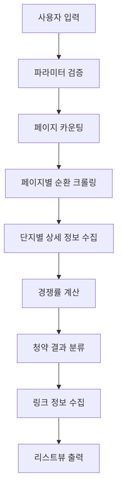
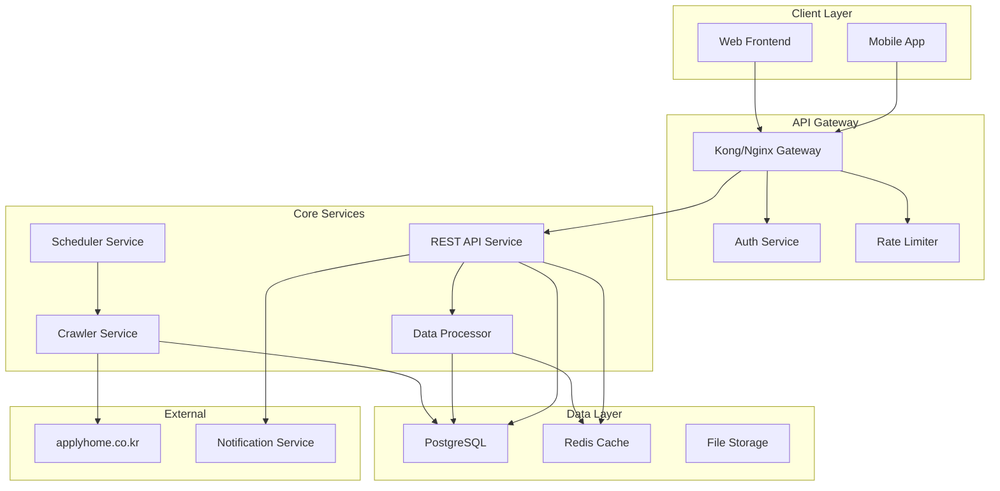
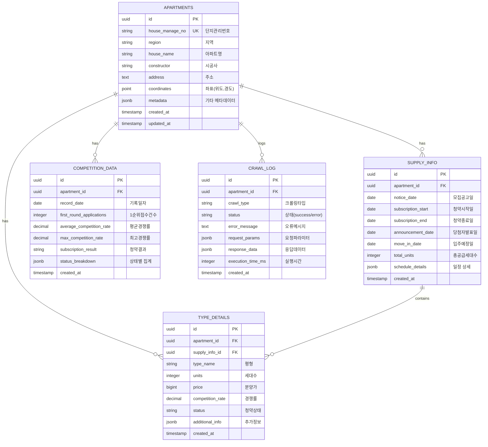
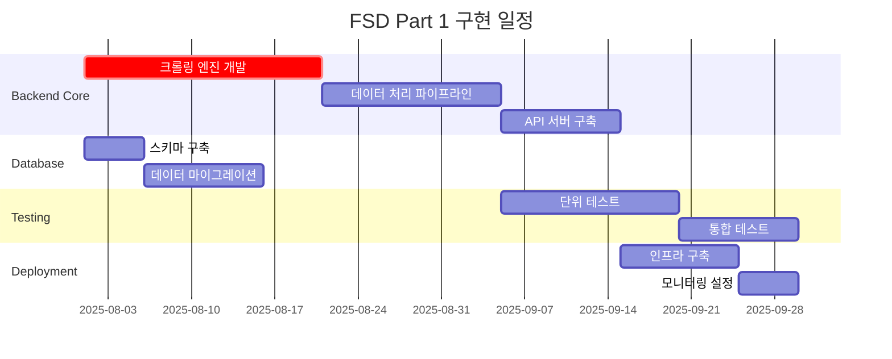

# 📋 데이터 크롤링 및 시각화 앱 기능 사양 문서 (FSD) - 파트 1: 크롤링 및 데이터 처리

**문서 버전:** 1.0  
**작성일:** 2025년 7월 24일  
**작성자:** Technical Architecture Team  
**승인자:** Technical Lead

---

## 🎯 1. 문서 개요

### 1.1 문서 목적
본 문서는 기존 VBA 매크로 기반 청약 데이터 크롤링 시스템을 현대적인 웹 애플리케이션으로 전환하기 위한 기술 사양을 정의합니다. 특히 **크롤링 및 데이터 처리** 기능에 초점을 맞춰 상세한 구현 방안을 제시합니다.

### 1.2 범위 및 제약사항
- **포함**: 데이터 크롤링, 데이터 처리, API 설계, 데이터베이스 스키마, 에러 처리
- **제외**: 프론트엔드 UI/UX, 사용자 인증, 배포 전략 (향후 파트에서 다룸)
- **기술 제약**: Node.js 기반 백엔드, PostgreSQL 데이터베이스

### 1.3 참조 문서
- PRD.md (제품 요구사항 문서)
- apply.md (기존 VBA 매크로 코드)
- PROJECT_PLAN.md (프로젝트 계획서)

---

## 🔍 2. 기존 VBA 로직 분석

### 2.1 현재 시스템 아키텍처

#### 2.1.1 VBA 매크로 구조 분석
```vba
// 핵심 프로시저 구조
Apply_Setting()    // 초기 설정 및 옵션 로딩
Apply_List()       // 리스트뷰 컬럼 설정
Apply_Run()        // 메인 크롤링 및 데이터 처리 로직
```

**🔧 주요 기능 분해:**

| 함수명 | 기능 | HTTP 요청 | 처리 데이터 |
|--------|------|-----------|-------------|
| `Apply_Setting()` | 드롭다운 옵션 로딩 | 1회 GET | 년도, 지역 옵션 |
| `Apply_List()` | UI 컬럼 설정 | 없음 | ListView 메타데이터 |
| `Apply_Run()` | 데이터 크롤링 & 처리 | 다중 POST | 분양정보, 경쟁률 |

#### 2.1.2 데이터 수집 프로세스 플로우


### 2.2 크롤링 대상 분석

#### 2.2.1 웹사이트 엔드포인트 매핑

**🎯 Primary Endpoints:**

| 순서 | URL | Method | 용도 | 응답 형식 |
|------|-----|--------|------|-----------|
| 1 | `applyhome.co.kr/ai/aia/selectAPTLttotPblancListView.do` | POST | 분양공고 목록 | HTML |
| 2 | `applyhome.co.kr/ai/aia/selectAPTCompetitionPopup.do` | POST | 경쟁률 상세 | HTML |
| 3 | `applyhome.co.kr/ai/aia/selectAPTLttotPblancDetail.do` | POST | 상세정보 링크 | HTML |

**📊 요청 파라미터 구조:**

```javascript
// 엔드포인트 1: 분양공고 목록
const listParams = {
  beginPd: "202401",      // 시작년월 (YYYYMM)
  endPd: "202412",        // 종료년월 (YYYYMM)
  houseDetailSecd: "01",  // 주택구분 (01:민영, 03:국민)
  suplyAreaCode: "",      // 공급지역코드 (URLEncoded)
  houseNm: "",           // 단지명 검색어 (URLEncoded)
  pageIndex: 1           // 페이지 번호
};

// 엔드포인트 2: 경쟁률 상세
const competitionParams = {
  houseManageNo: "2024000001",  // 단지관리번호
  pblancNo: "2024000001",       // 공고번호
  houseNm: "",                  // 단지명 (URLEncoded)
  gvPgmId: "AIA01M01"          // 프로그램ID (고정값)
};

// 엔드포인트 3: 상세정보 링크
const detailParams = {
  houseManageNo: "2024000001",  // 단지관리번호
  pblancNo: "2024000001",       // 공고번호
  gvPgmId: "AIA01M01"          // 프로그램ID (고정값)
};
```

### 2.3 데이터 처리 로직 분석

#### 2.3.1 경쟁률 계산 알고리즘
```vba
// VBA 원본 로직
P(k, 16) = P(k, 8) / P(k, 7)  // 평균경쟁률 = 1순위접수건 / 공급세대수
P(k, 16) = Format(P(k, 16), "0.00")
```

**🧮 JavaScript 전환 알고리즘:**
```javascript
const calculateCompetitionRate = (applications, supply) => {
  if (supply === 0) return { rate: 0, formatted: "0.00:1", status: "미공급" };
  
  const rate = applications / supply;
  return {
    rate: Math.round(rate * 100) / 100,
    formatted: `${rate.toFixed(2)}:1`,
    status: classifyCompetitionLevel(rate)
  };
};

const classifyCompetitionLevel = (rate) => {
  if (rate >= 100) return "초고경쟁";
  if (rate >= 50) return "고경쟁";
  if (rate >= 10) return "중경쟁";
  if (rate >= 1) return "저경쟁";
  return "미달";
};
```

#### 2.3.2 청약 결과 분류 로직
```javascript
// VBA 로직을 JavaScript로 전환
const classifySubscriptionResult = (statusCounts, totalTypes) => {
  const { 
    firstLocal,     // 1순위 당해지역 마감 타입 수
    firstOther,     // 1순위 기타지역 마감 타입 수  
    secondLocal,    // 2순위 당해지역 마감 타입 수
    secondOther,    // 2순위 기타지역 마감 타입 수
    underSubscribed, // 미달 타입 수
    inProgress      // 접수중 타입 수
  } = statusCounts;

  // VBA 원본과 동일한 분류 로직
  if (firstLocal === totalTypes) return "1순위 당해마감";
  if (firstOther > 0 && secondLocal === 0 && secondOther === 0) return "1순위 기타마감";
  if (secondLocal > 0 && secondOther === 0) return "2순위 당해마감";
  if (secondOther > 0) return "2순위 기타마감";
  if (underSubscribed === totalTypes) return "전체 미달";
  if (inProgress > 0) return "청약 접수중";
  if (underSubscribed > 0) return "일부타입 미달";
  
  return "청약 접수일 미도래";
};
```

---

## 🏗️ 3. 시스템 아키텍처 설계

### 3.1 전체 시스템 구조

#### 3.1.1 마이크로서비스 아키텍처


#### 3.1.2 기술 스택 선정

**🔧 Backend Stack:**
```yaml
Runtime: Node.js 18+ LTS
Framework: Express.js 4.18+
Language: TypeScript 5.0+
ORM: Prisma 5.0+
Validation: Zod 3.0+
Testing: Jest + Supertest
Documentation: Swagger/OpenAPI 3.0
```

**🗄️ Database Stack:**
```yaml
Primary DB: PostgreSQL 15+
Cache: Redis 7.0+
Queue: Bull Queue (Redis-based)
Search: PostgreSQL Full-text Search
Backup: pg_dump + AWS S3
Monitoring: Prometheus + Grafana
```

**🕸️ Crawling Stack:**
```yaml
HTTP Client: Axios with interceptors
HTML Parser: Cheerio
Browser Automation: Puppeteer (백업용)
Scheduling: node-cron
Rate Limiting: bottleneck
Error Handling: exponential-backoff
```

### 3.2 크롤러 서비스 설계

#### 3.2.1 크롤러 아키텍처
```typescript
// 크롤러 서비스 인터페이스
interface CrawlerService {
  // 메인 크롤링 메서드
  crawlApartmentData(params: CrawlParams): Promise<CrawlResult>;
  
  // 개별 엔드포인트 크롤러
  fetchApartmentList(listParams: ListParams): Promise<ApartmentListItem[]>;
  fetchCompetitionDetails(aptId: string): Promise<CompetitionData>;
  fetchDetailLinks(aptId: string): Promise<LinkData>;
  
  // 스케줄링 및 모니터링
  scheduleRoutineCrawl(): void;
  getHealthStatus(): HealthStatus;
}

// 데이터 타입 정의
interface CrawlParams {
  startDate: string;    // YYYYMM
  endDate: string;      // YYYYMM
  region?: string;      // 지역 코드
  keyword?: string;     // 검색 키워드
  includeLinks?: boolean; // 링크 정보 포함 여부
}

interface CrawlResult {
  totalCount: number;
  apartments: ApartmentData[];
  errors: CrawlError[];
  executionTime: number;
  timestamp: Date;
}
```

#### 3.2.2 크롤링 플로우 구현
```typescript
class ApartmentCrawler implements CrawlerService {
  private httpClient: AxiosInstance;
  private parser: CheerioAPI;
  private rateLimiter: Bottleneck;

  constructor() {
    this.httpClient = this.createHttpClient();
    this.rateLimiter = new Bottleneck({
      maxConcurrent: 5,     // 최대 동시 요청 수
      minTime: 200          // 요청 간 최소 간격 (ms)
    });
  }

  async crawlApartmentData(params: CrawlParams): Promise<CrawlResult> {
    const startTime = Date.now();
    const errors: CrawlError[] = [];
    
    try {
      // 1단계: 파라미터 검증
      this.validateParams(params);
      
      // 2단계: 페이지 카운팅
      const totalCount = await this.getTotalCount(params);
      if (totalCount === 0) {
        return { totalCount: 0, apartments: [], errors, executionTime: 0, timestamp: new Date() };
      }
      
      // 3단계: 페이지별 데이터 수집
      const apartments = await this.crawlAllPages(params, totalCount);
      
      // 4단계: 경쟁률 상세 정보 수집
      await this.enrichWithCompetitionData(apartments);
      
      // 5단계: 링크 정보 수집 (옵션)
      if (params.includeLinks) {
        await this.enrichWithLinks(apartments);
      }
      
      return {
        totalCount,
        apartments,
        errors,
        executionTime: Date.now() - startTime,
        timestamp: new Date()
      };
      
    } catch (error) {
      errors.push(this.handleCrawlError(error));
      throw new CrawlError(`크롤링 처리 중 오류 발생: ${error.message}`);
    }
  }

  private async getTotalCount(params: CrawlParams): Promise<number> {
    const payload = this.buildListPayload(params, 1);
    const response = await this.rateLimiter.schedule(() => 
      this.httpClient.post(ENDPOINTS.APARTMENT_LIST, payload)
    );
    
    const $ = cheerio.load(response.data);
    const totalText = $('.total_txt.dis_in_imp span b').text();
    return parseInt(totalText.replace(/,/g, '')) || 0;
  }

  private async crawlAllPages(params: CrawlParams, totalCount: number): Promise<ApartmentData[]> {
    const apartments: ApartmentData[] = [];
    const pageCount = Math.ceil(totalCount / 10);
    
    // 병렬 페이지 크롤링 (제한된 동시 실행)
    const pagePromises = Array.from({ length: pageCount }, (_, i) => 
      this.rateLimiter.schedule(() => this.crawlSinglePage(params, i + 1))
    );
    
    const pageResults = await Promise.allSettled(pagePromises);
    
    pageResults.forEach((result, index) => {
      if (result.status === 'fulfilled') {
        apartments.push(...result.value);
      } else {
        console.error(`페이지 ${index + 1} 크롤링 실패:`, result.reason);
      }
    });
    
    return apartments;
  }
}
```

### 3.3 데이터 처리 서비스 설계

#### 3.3.1 데이터 파이프라인
```typescript
class DataProcessor {
  async processRawData(rawData: RawApartmentData[]): Promise<ProcessedApartmentData[]> {
    const pipeline = new DataPipeline([
      new ValidationStage(),
      new NormalizationStage(),
      new CalculationStage(),
      new ClassificationStage(),
      new DeduplicationStage()
    ]);
    
    return pipeline.process(rawData);
  }
}

// 데이터 처리 스테이지
class CalculationStage implements PipelineStage<ApartmentData> {
  async process(data: ApartmentData[]): Promise<ApartmentData[]> {
    return data.map(apartment => ({
      ...apartment,
      competitionRate: this.calculateCompetitionRate(
        apartment.applications, 
        apartment.supply
      ),
      subscriptionResult: this.classifyResult(apartment.statusCounts),
      maxCompetitionRate: this.findMaxCompetitionRate(apartment.typeDetails)
    }));
  }

  private calculateCompetitionRate(applications: number, supply: number): CompetitionRate {
    if (supply === 0) return { rate: 0, formatted: "0.00:1", level: "미공급" };
    
    const rate = Number((applications / supply).toFixed(2));
    return {
      rate,
      formatted: `${rate.toFixed(2)}:1`,
      level: this.getCompetitionLevel(rate)
    };
  }

  private getCompetitionLevel(rate: number): string {
    const levels = [
      { threshold: 100, level: "초고경쟁" },
      { threshold: 50, level: "고경쟁" },
      { threshold: 10, level: "중경쟁" },
      { threshold: 1, level: "저경쟁" }
    ];
    
    return levels.find(l => rate >= l.threshold)?.level || "미달";
  }
}
```

---

## 🗄️ 4. 데이터베이스 설계

### 4.1 데이터 모델링

#### 4.1.1 ERD (Entity Relationship Diagram)


#### 4.1.2 테이블 스키마 정의
```sql
-- 아파트 기본정보 테이블
CREATE TABLE apartments (
    id UUID PRIMARY KEY DEFAULT gen_random_uuid(),
    house_manage_no VARCHAR(50) UNIQUE NOT NULL,
    region VARCHAR(100) NOT NULL,
    house_name VARCHAR(200) NOT NULL,
    constructor VARCHAR(100),
    address TEXT,
    coordinates POINT, -- PostGIS 확장 사용
    metadata JSONB DEFAULT '{}',
    created_at TIMESTAMP WITH TIME ZONE DEFAULT NOW(),
    updated_at TIMESTAMP WITH TIME ZONE DEFAULT NOW()
);

-- 공급정보 테이블 (이력 관리)
CREATE TABLE supply_info (
    id UUID PRIMARY KEY DEFAULT gen_random_uuid(),
    apartment_id UUID NOT NULL REFERENCES apartments(id) ON DELETE CASCADE,
    notice_date DATE,
    subscription_start DATE,
    subscription_end DATE,
    announcement_date DATE,
    move_in_date DATE,
    total_units INTEGER CHECK (total_units >= 0),
    schedule_details JSONB DEFAULT '{}',
    created_at TIMESTAMP WITH TIME ZONE DEFAULT NOW()
);

-- 경쟁률 데이터 테이블 (시계열)
CREATE TABLE competition_data (
    id UUID PRIMARY KEY DEFAULT gen_random_uuid(),
    apartment_id UUID NOT NULL REFERENCES apartments(id) ON DELETE CASCADE,
    record_date DATE NOT NULL,
    first_round_applications INTEGER DEFAULT 0,
    average_competition_rate DECIMAL(10,2) DEFAULT 0.00,
    max_competition_rate DECIMAL(10,2) DEFAULT 0.00,
    subscription_result VARCHAR(50) DEFAULT '접수전',
    status_breakdown JSONB DEFAULT '{}',
    created_at TIMESTAMP WITH TIME ZONE DEFAULT NOW(),
    UNIQUE(apartment_id, record_date) -- 일자별 중복 방지
);

-- 평형별 상세정보 테이블
CREATE TABLE type_details (
    id UUID PRIMARY KEY DEFAULT gen_random_uuid(),
    apartment_id UUID NOT NULL REFERENCES apartments(id) ON DELETE CASCADE,
    supply_info_id UUID REFERENCES supply_info(id) ON DELETE CASCADE,
    type_name VARCHAR(50) NOT NULL,
    units INTEGER CHECK (units >= 0),
    price BIGINT CHECK (price >= 0),
    competition_rate DECIMAL(10,2) DEFAULT 0.00,
    status VARCHAR(50) DEFAULT '접수전',
    additional_info JSONB DEFAULT '{}',
    created_at TIMESTAMP WITH TIME ZONE DEFAULT NOW()
);

-- 크롤링 로그 테이블
CREATE TABLE crawl_log (
    id UUID PRIMARY KEY DEFAULT gen_random_uuid(),
    apartment_id UUID REFERENCES apartments(id) ON DELETE SET NULL,
    crawl_type VARCHAR(50) NOT NULL, -- 'list', 'competition', 'details'
    status VARCHAR(20) NOT NULL CHECK (status IN ('success', 'error', 'partial')),
    error_message TEXT,
    request_params JSONB,
    response_data JSONB,
    execution_time_ms INTEGER,
    created_at TIMESTAMP WITH TIME ZONE DEFAULT NOW()
);

-- 인덱스 생성
CREATE INDEX idx_apartments_region ON apartments(region);
CREATE INDEX idx_apartments_house_name ON apartments USING GIN(to_tsvector('korean', house_name));
CREATE INDEX idx_competition_data_date ON competition_data(record_date);
CREATE INDEX idx_competition_data_apartment_date ON competition_data(apartment_id, record_date DESC);
CREATE INDEX idx_crawl_log_status_date ON crawl_log(status, created_at DESC);

-- 트리거 함수 (updated_at 자동 갱신)
CREATE OR REPLACE FUNCTION update_updated_at_column()
RETURNS TRIGGER AS $$
BEGIN
    NEW.updated_at = NOW();
    RETURN NEW;
END;
$$ language 'plpgsql';

CREATE TRIGGER update_apartments_updated_at 
    BEFORE UPDATE ON apartments 
    FOR EACH ROW EXECUTE FUNCTION update_updated_at_column();
```

### 4.2 데이터 접근 계층 (DAL)

#### 4.2.1 Repository 패턴 구현
```typescript
// Base Repository
abstract class BaseRepository<T> {
  protected db: PrismaClient;
  
  constructor(db: PrismaClient) {
    this.db = db;
  }
  
  abstract create(data: Partial<T>): Promise<T>;
  abstract findById(id: string): Promise<T | null>;
  abstract update(id: string, data: Partial<T>): Promise<T>;
  abstract delete(id: string): Promise<void>;
}

// Apartment Repository
class ApartmentRepository extends BaseRepository<Apartment> {
  async create(data: Partial<Apartment>): Promise<Apartment> {
    return this.db.apartment.create({
      data: data as Prisma.ApartmentCreateInput
    });
  }

  async findByHouseManageNo(houseManageNo: string): Promise<Apartment | null> {
    return this.db.apartment.findUnique({
      where: { house_manage_no: houseManageNo },
      include: {
        supply_info: true,
        competition_data: {
          orderBy: { record_date: 'desc' },
          take: 1
        },
        type_details: true
      }
    });
  }

  async findByRegionAndPeriod(
    region: string, 
    startDate: Date, 
    endDate: Date
  ): Promise<Apartment[]> {
    return this.db.apartment.findMany({
      where: {
        region: region,
        supply_info: {
          some: {
            notice_date: {
              gte: startDate,
              lte: endDate
            }
          }
        }
      },
      include: {
        supply_info: true,
        competition_data: {
          orderBy: { record_date: 'desc' },
          take: 1
        }
      }
    });
  }

  async upsert(data: Partial<Apartment>): Promise<Apartment> {
    return this.db.apartment.upsert({
      where: { house_manage_no: data.house_manage_no },
      update: data as Prisma.ApartmentUpdateInput,
      create: data as Prisma.ApartmentCreateInput
    });
  }
}

// Competition Data Repository  
class CompetitionDataRepository extends BaseRepository<CompetitionData> {
  async createOrUpdateDaily(
    apartmentId: string, 
    recordDate: Date, 
    data: Partial<CompetitionData>
  ): Promise<CompetitionData> {
    return this.db.competitionData.upsert({
      where: {
        apartment_id_record_date: {
          apartment_id: apartmentId,
          record_date: recordDate
        }
      },
      update: data as Prisma.CompetitionDataUpdateInput,
      create: {
        apartment_id: apartmentId,
        record_date: recordDate,
        ...data
      } as Prisma.CompetitionDataCreateInput
    });
  }

  async getHistoricalData(
    apartmentId: string, 
    days: number = 30
  ): Promise<CompetitionData[]> {
    const startDate = new Date();
    startDate.setDate(startDate.getDate() - days);

    return this.db.competitionData.findMany({
      where: {
        apartment_id: apartmentId,
        record_date: { gte: startDate }
      },
      orderBy: { record_date: 'asc' }
    });
  }
}
```

---

## 🔌 5. API 설계

### 5.1 RESTful API 엔드포인트

#### 5.1.1 API 구조 개요
```yaml
Base URL: https://api.apartment-subscription.com/v1

Authentication: Bearer JWT Token
Rate Limiting: 1000 requests/hour per user
Response Format: JSON
Error Format: RFC 7807 Problem Details
```

#### 5.1.2 크롤링 관련 API
```typescript
// 크롤링 트리거 API
interface CrawlTriggerRequest {
  startDate: string;        // YYYY-MM format
  endDate: string;          // YYYY-MM format  
  region?: string;          // 지역 필터
  keyword?: string;         // 검색 키워드
  includeLinks?: boolean;   // 링크 정보 포함 여부
  priority?: 'high' | 'normal' | 'low'; // 우선순위
}

interface CrawlTriggerResponse {
  jobId: string;           // 작업 ID
  status: 'queued' | 'processing' | 'completed' | 'failed';
  estimatedDuration: number; // 예상 소요시간 (초)
  queuePosition?: number;   // 대기 순번
  createdAt: string;       // ISO 8601 날짜
}

// POST /api/v1/crawl/trigger
// 새로운 크롤링 작업 시작
router.post('/crawl/trigger', 
  validateRequest(CrawlTriggerSchema),
  rateLimiter({ windowMs: 60000, max: 10 }), // 분당 10회 제한
  async (req: Request, res: Response) => {
    try {
      const params = req.body as CrawlTriggerRequest;
      
      // 파라미터 검증
      const validation = await validateCrawlParams(params);
      if (!validation.isValid) {
        return res.status(400).json({
          error: 'INVALID_PARAMETERS',
          message: validation.message,
          details: validation.errors
        });
      }

      // 크롤링 작업 큐에 추가
      const job = await crawlQueue.add('apartment-crawl', params, {
        priority: getPriorityScore(params.priority),
        attempts: 3,
        backoff: { type: 'exponential', delay: 2000 }
      });

      res.status(202).json({
        jobId: job.id,
        status: 'queued',
        estimatedDuration: estimateCrawlDuration(params),
        queuePosition: await getQueuePosition(job.id),
        createdAt: new Date().toISOString()
      });

    } catch (error) {
      logger.error('크롤링 트리거 오류:', error);
      res.status(500).json({
        error: 'INTERNAL_ERROR',
        message: '크롤링 작업 생성 중 오류가 발생했습니다.'
      });
    }
  }
);

// GET /api/v1/crawl/status/{jobId}
// 크롤링 작업 상태 조회
router.get('/crawl/status/:jobId', async (req: Request, res: Response) => {
  try {
    const { jobId } = req.params;
    const job = await crawlQueue.getJob(jobId);
    
    if (!job) {
      return res.status(404).json({
        error: 'JOB_NOT_FOUND',
        message: '해당 작업을 찾을 수 없습니다.'
      });
    }

    const progress = job.progress() as CrawlProgress;
    
    res.json({
      jobId: job.id,
      status: await job.getState(),
      progress: {
        percentage: progress.percentage,
        currentStep: progress.currentStep,
        totalSteps: progress.totalSteps,
        processedCount: progress.processedCount,
        errorCount: progress.errorCount
      },
      result: job.returnvalue,
      error: job.failedReason,
      createdAt: new Date(job.timestamp).toISOString(),
      completedAt: job.finishedOn ? new Date(job.finishedOn).toISOString() : null
    });

  } catch (error) {
    logger.error('크롤링 상태 조회 오류:', error);
    res.status(500).json({
      error: 'INTERNAL_ERROR', 
      message: '작업 상태 조회 중 오류가 발생했습니다.'
    });
  }
});
```

#### 5.1.3 데이터 조회 API
```typescript
// 아파트 데이터 검색 API
interface ApartmentSearchRequest {
  region?: string;           // 지역 필터
  startDate?: string;        // 공고 시작일 (YYYY-MM-DD)
  endDate?: string;          // 공고 종료일 (YYYY-MM-DD)
  keyword?: string;          // 단지명 검색
  minCompetitionRate?: number; // 최소 경쟁률
  maxCompetitionRate?: number; // 최대 경쟁률
  subscriptionStatus?: string; // 청약 상태
  sortBy?: 'competition_rate' | 'notice_date' | 'house_name';
  sortOrder?: 'asc' | 'desc';
  page?: number;             // 페이지 번호 (1부터 시작)
  limit?: number;            // 페이지당 항목 수 (최대 100)
}

interface ApartmentSearchResponse {
  data: ApartmentData[];
  pagination: {
    page: number;
    limit: number;
    total: number;
    totalPages: number;
    hasNext: boolean;
    hasPrev: boolean;
  };
  filters: {
    appliedFilters: Record<string, any>;
    availableRegions: string[];
    competitionRateRange: { min: number; max: number };
  };
}

// GET /api/v1/apartments/search
router.get('/apartments/search', 
  validateRequest(ApartmentSearchSchema),
  cacheMiddleware(300), // 5분 캐싱
  async (req: Request, res: Response) => {
    try {
      const params = req.query as ApartmentSearchRequest;
      
      // 기본값 설정
      const page = Math.max(1, parseInt(params.page?.toString() || '1'));
      const limit = Math.min(100, Math.max(1, parseInt(params.limit?.toString() || '20')));
      const offset = (page - 1) * limit;

      // 동적 필터 구성
      const whereClause = buildWhereClause(params);
      const orderClause = buildOrderClause(params.sortBy, params.sortOrder);

      // 데이터 조회
      const [apartments, totalCount] = await Promise.all([
        apartmentRepository.findMany({
          where: whereClause,
          orderBy: orderClause,
          skip: offset,
          take: limit,
          include: {
            supply_info: true,
            competition_data: {
              orderBy: { record_date: 'desc' },
              take: 1
            },
            type_details: true
          }
        }),
        apartmentRepository.count({ where: whereClause })
      ]);

      // 응답 데이터 구성
      const response: ApartmentSearchResponse = {
        data: apartments.map(transformApartmentData),
        pagination: {
          page,
          limit,
          total: totalCount,
          totalPages: Math.ceil(totalCount / limit),
          hasNext: page * limit < totalCount,
          hasPrev: page > 1
        },
        filters: {
          appliedFilters: params,
          availableRegions: await getAvailableRegions(),
          competitionRateRange: await getCompetitionRateRange()
        }
      };

      res.json(response);

    } catch (error) {
      logger.error('아파트 검색 오류:', error);
      res.status(500).json({
        error: 'SEARCH_ERROR',
        message: '검색 처리 중 오류가 발생했습니다.'
      });
    }
  }
);

// GET /api/v1/apartments/{id}/competition-history
// 특정 아파트의 경쟁률 이력 조회
router.get('/apartments/:id/competition-history', 
  cacheMiddleware(600), // 10분 캐싱
  async (req: Request, res: Response) => {
    try {
      const { id } = req.params;
      const { days = 30 } = req.query;
      
      const apartment = await apartmentRepository.findById(id);
      if (!apartment) {
        return res.status(404).json({
          error: 'APARTMENT_NOT_FOUND',
          message: '해당 아파트를 찾을 수 없습니다.'
        });
      }

      const history = await competitionDataRepository.getHistoricalData(id, Number(days));
      
      res.json({
        apartment: {
          id: apartment.id,
          houseName: apartment.house_name,
          region: apartment.region
        },
        history: history.map(record => ({
          date: record.record_date.toISOString().split('T')[0],
          averageCompetitionRate: record.average_competition_rate,
          maxCompetitionRate: record.max_competition_rate,
          subscriptionResult: record.subscription_result,
          applications: record.first_round_applications
        })),
        period: {
          startDate: history[0]?.record_date.toISOString().split('T')[0],
          endDate: history[history.length - 1]?.record_date.toISOString().split('T')[0],
          totalRecords: history.length
        }
      });

    } catch (error) {
      logger.error('경쟁률 이력 조회 오류:', error);
      res.status(500).json({
        error: 'HISTORY_ERROR',
        message: '경쟁률 이력 조회 중 오류가 발생했습니다.'
      });
    }
  }
);
```

### 5.2 실시간 데이터 API

#### 5.2.1 WebSocket 이벤트 설계
```typescript
// WebSocket 이벤트 정의
interface WebSocketEvents {
  // 클라이언트 → 서버
  'subscribe:apartment': { apartmentId: string };
  'subscribe:region': { region: string };
  'unsubscribe:apartment': { apartmentId: string };
  'unsubscribe:region': { region: string };
  
  // 서버 → 클라이언트  
  'competition:update': CompetitionUpdateEvent;
  'crawl:progress': CrawlProgressEvent;
  'system:status': SystemStatusEvent;
}

interface CompetitionUpdateEvent {
  apartmentId: string;
  houseName: string;
  region: string;
  previousRate: number;
  currentRate: number;
  change: number;
  changePercent: number;
  timestamp: string;
}

interface CrawlProgressEvent {
  jobId: string;
  status: 'processing' | 'completed' | 'failed';
  progress: {
    percentage: number;
    currentStep: string;
    processedCount: number;
    totalCount: number;
    errorCount: number;
  };
  estimatedTimeRemaining?: number;
}

// WebSocket 서버 구현
class WebSocketService {
  private io: SocketIOServer;
  private subscriptions: Map<string, Set<string>> = new Map();

  constructor(server: http.Server) {
    this.io = new SocketIOServer(server, {
      cors: { origin: process.env.FRONTEND_URL },
      transports: ['websocket', 'polling']
    });
    
    this.setupEventHandlers();
  }

  private setupEventHandlers() {
    this.io.on('connection', (socket: Socket) => {
      console.log(`클라이언트 연결: ${socket.id}`);

      // 아파트별 구독
      socket.on('subscribe:apartment', ({ apartmentId }: { apartmentId: string }) => {
        const room = `apartment:${apartmentId}`;
        socket.join(room);
        
        if (!this.subscriptions.has(room)) {
          this.subscriptions.set(room, new Set());
        }
        this.subscriptions.get(room)!.add(socket.id);
        
        console.log(`${socket.id}가 ${apartmentId} 아파트 구독`);
      });

      // 지역별 구독
      socket.on('subscribe:region', ({ region }: { region: string }) => {
        const room = `region:${region}`;
        socket.join(room);
        
        if (!this.subscriptions.has(room)) {
          this.subscriptions.set(room, new Set());
        }
        this.subscriptions.get(room)!.add(socket.id);
        
        console.log(`${socket.id}가 ${region} 지역 구독`);
      });

      // 연결 해제 처리
      socket.on('disconnect', () => {
        this.cleanupSubscriptions(socket.id);
        console.log(`클라이언트 연결 해제: ${socket.id}`);
      });
    });
  }

  // 경쟁률 업데이트 브로드캐스트
  broadcastCompetitionUpdate(apartmentId: string, updateData: CompetitionUpdateEvent) {
    this.io.to(`apartment:${apartmentId}`).emit('competition:update', updateData);
    this.io.to(`region:${updateData.region}`).emit('competition:update', updateData);
  }

  // 크롤링 진행상황 브로드캐스트
  broadcastCrawlProgress(jobId: string, progressData: CrawlProgressEvent) {
    this.io.emit('crawl:progress', progressData);
  }

  private cleanupSubscriptions(socketId: string) {
    this.subscriptions.forEach((subscribers, room) => {
      subscribers.delete(socketId);
      if (subscribers.size === 0) {
        this.subscriptions.delete(room);
      }
    });
  }
}
```

---

## 🛡️ 6. 에러 처리 및 로깅 전략

### 6.1 에러 처리 아키텍처

#### 6.1.1 에러 분류 체계
```typescript
// 에러 타입 정의
enum ErrorType {
  VALIDATION_ERROR = 'VALIDATION_ERROR',
  NETWORK_ERROR = 'NETWORK_ERROR',
  PARSING_ERROR = 'PARSING_ERROR',
  DATABASE_ERROR = 'DATABASE_ERROR',
  RATE_LIMIT_ERROR = 'RATE_LIMIT_ERROR',
  TIMEOUT_ERROR = 'TIMEOUT_ERROR',
  AUTHENTICATION_ERROR = 'AUTHENTICATION_ERROR',
  AUTHORIZATION_ERROR = 'AUTHORIZATION_ERROR',
  RESOURCE_NOT_FOUND = 'RESOURCE_NOT_FOUND',
  INTERNAL_ERROR = 'INTERNAL_ERROR'
}

// 에러 심각도 레벨
enum ErrorSeverity {
  LOW = 1,      // 정보성, 재시도 불필요
  MEDIUM = 2,   // 경고, 재시도 가능
  HIGH = 3,     // 오류, 즉시 재시도 필요
  CRITICAL = 4  // 치명적, 즉시 개입 필요
}

// 커스텀 에러 클래스
class AppError extends Error {
  public readonly type: ErrorType;
  public readonly severity: ErrorSeverity;
  public readonly context: Record<string, any>;
  public readonly timestamp: Date;
  public readonly requestId?: string;

  constructor(
    type: ErrorType,
    message: string,
    severity: ErrorSeverity = ErrorSeverity.MEDIUM,
    context: Record<string, any> = {},
    requestId?: string
  ) {
    super(message);
    this.type = type;
    this.severity = severity;
    this.context = context;
    this.timestamp = new Date();
    this.requestId = requestId;
    this.name = 'AppError';
  }
}

// 크롤링 전용 에러 클래스
class CrawlError extends AppError {
  public readonly url?: string;
  public readonly httpStatus?: number;
  public readonly retryCount?: number;

  constructor(
    message: string,
    context: {
      url?: string;
      httpStatus?: number;
      retryCount?: number;
      apartmentId?: string;
    } = {}
  ) {
    super(
      ErrorType.NETWORK_ERROR,
      message,
      ErrorSeverity.HIGH,
      context
    );
    
    this.url = context.url;
    this.httpStatus = context.httpStatus;
    this.retryCount = context.retryCount;
  }
}
```

#### 6.1.2 에러 핸들링 미들웨어
```typescript
// 글로벌 에러 핸들러
class ErrorHandler {
  static handle(error: Error, req: Request, res: Response, next: NextFunction) {
    const requestId = req.headers['x-request-id'] as string;
    
    // AppError 타입 체크
    if (error instanceof AppError) {
      ErrorHandler.handleAppError(error, req, res, requestId);
    } else if (error instanceof ValidationError) {
      ErrorHandler.handleValidationError(error, req, res, requestId);
    } else {
      ErrorHandler.handleUnknownError(error, req, res, requestId);
    }
  }

  private static handleAppError(error: AppError, req: Request, res: Response, requestId: string) {
    const statusCode = ErrorHandler.getHttpStatusCode(error.type);
    
    // 로깅
    logger.error('애플리케이션 오류', {
      type: error.type,
      severity: error.severity,
      message: error.message,
      context: error.context,
      requestId,
      url: req.url,
      method: req.method,
      userAgent: req.get('User-Agent'),
      stack: error.stack
    });

    // 클라이언트 응답
    res.status(statusCode).json({
      error: {
        type: error.type,
        message: error.message,
        requestId,
        timestamp: error.timestamp.toISOString(),
        ...(process.env.NODE_ENV === 'development' && { stack: error.stack })
      }
    });

    // 치명적 오류인 경우 알림 발송
    if (error.severity === ErrorSeverity.CRITICAL) {
      AlertService.sendCriticalAlert(error, requestId);
    }
  }

  private static getHttpStatusCode(errorType: ErrorType): number {
    const statusMap: Record<ErrorType, number> = {
      [ErrorType.VALIDATION_ERROR]: 400,
      [ErrorType.AUTHENTICATION_ERROR]: 401,
      [ErrorType.AUTHORIZATION_ERROR]: 403,
      [ErrorType.RESOURCE_NOT_FOUND]: 404,
      [ErrorType.RATE_LIMIT_ERROR]: 429,
      [ErrorType.NETWORK_ERROR]: 502,
      [ErrorType.TIMEOUT_ERROR]: 504,
      [ErrorType.DATABASE_ERROR]: 500,
      [ErrorType.PARSING_ERROR]: 500,
      [ErrorType.INTERNAL_ERROR]: 500
    };
    
    return statusMap[errorType] || 500;
  }
}

// 크롤링 에러 복구 전략
class CrawlErrorRecovery {
  private static readonly MAX_RETRIES = 3;
  private static readonly RETRY_DELAYS = [1000, 2000, 5000]; // ms

  static async withRetry<T>(
    operation: () => Promise<T>,
    context: { url?: string; apartmentId?: string } = {}
  ): Promise<T> {
    let lastError: Error;
    
    for (let attempt = 0; attempt < this.MAX_RETRIES; attempt++) {
      try {
        return await operation();
      } catch (error) {
        lastError = error;
        
        // 재시도 불가능한 오류인 경우 즉시 실패
        if (this.isNonRetryableError(error)) {
          throw new CrawlError(`재시도 불가능한 오류: ${error.message}`, {
            ...context,
            retryCount: attempt
          });
        }

        // 마지막 시도인 경우 실패
        if (attempt === this.MAX_RETRIES - 1) {
          throw new CrawlError(`최대 재시도 횟수 초과: ${error.message}`, {
            ...context,
            retryCount: attempt + 1
          });
        }

        // 재시도 대기
        await this.delay(this.RETRY_DELAYS[attempt]);
        
        logger.warn(`크롤링 재시도 ${attempt + 1}/${this.MAX_RETRIES}`, {
          error: error.message,
          context,
          nextRetryIn: this.RETRY_DELAYS[attempt]
        });
      }
    }
    
    throw lastError!;
  }

  private static isNonRetryableError(error: any): boolean {
    // HTTP 4xx 에러 (클라이언트 오류)는 재시도하지 않음
    if (error.response?.status >= 400 && error.response?.status < 500) {
      return true;
    }
    
    // 파싱 에러는 재시도해도 소용없음
    if (error instanceof SyntaxError) {
      return true;
    }
    
    return false;
  }

  private static delay(ms: number): Promise<void> {
    return new Promise(resolve => setTimeout(resolve, ms));
  }
}
```

### 6.2 로깅 시스템

#### 6.2.1 구조화된 로깅
```typescript
// 로거 설정
import winston from 'winston';
import 'winston-daily-rotate-file';

// 로그 레벨 정의
enum LogLevel {
  ERROR = 'error',
  WARN = 'warn', 
  INFO = 'info',
  HTTP = 'http',
  DEBUG = 'debug'
}

// 로그 포맷 정의
const logFormat = winston.format.combine(
  winston.format.timestamp({ format: 'YYYY-MM-DD HH:mm:ss.SSS' }),
  winston.format.errors({ stack: true }),
  winston.format.json(),
  winston.format.printf(({ timestamp, level, message, ...meta }) => {
    return JSON.stringify({
      timestamp,
      level: level.toUpperCase(),
      message,
      ...meta
    });
  })
);

// 로거 생성
const logger = winston.createLogger({
  level: process.env.LOG_LEVEL || 'info',
  format: logFormat,
  defaultMeta: {
    service: 'apartment-crawler',
    version: process.env.APP_VERSION || '1.0.0',
    environment: process.env.NODE_ENV || 'development'
  },
  transports: [
    // 콘솔 출력
    new winston.transports.Console({
      format: winston.format.combine(
        winston.format.colorize(),
        winston.format.simple()
      )
    }),
    
    // 파일 로테이션 (일반 로그)
    new winston.transports.DailyRotateFile({
      filename: 'logs/application-%DATE%.log',
      datePattern: 'YYYY-MM-DD',
      maxSize: '20m',
      maxFiles: '14d',
      level: 'info'
    }),
    
    // 파일 로테이션 (에러 로그)
    new winston.transports.DailyRotateFile({
      filename: 'logs/error-%DATE%.log',
      datePattern: 'YYYY-MM-DD',
      maxSize: '20m',
      maxFiles: '30d',
      level: 'error'
    }),
    
    // 크롤링 전용 로그
    new winston.transports.DailyRotateFile({
      filename: 'logs/crawl-%DATE%.log',
      datePattern: 'YYYY-MM-DD',
      maxSize: '50m',
      maxFiles: '30d',
      format: winston.format.combine(
        winston.format.timestamp(),
        winston.format.json()
      )
    })
  ]
});

// 크롤링 전용 로거
class CrawlLogger {
  private logger: winston.Logger;

  constructor() {
    this.logger = logger.child({ component: 'crawler' });
  }

  logCrawlStart(jobId: string, params: CrawlParams) {
    this.logger.info('크롤링 시작', {
      jobId,
      params,
      event: 'crawl_start'
    });
  }

  logCrawlProgress(jobId: string, progress: CrawlProgress) {
    this.logger.info('크롤링 진행상황', {
      jobId,
      progress,
      event: 'crawl_progress'
    });
  }

  logCrawlComplete(jobId: string, result: CrawlResult) {
    this.logger.info('크롤링 완료', {
      jobId,
      totalCount: result.totalCount,
      errorCount: result.errors.length,
      executionTime: result.executionTime,
      event: 'crawl_complete'
    });
  }

  logCrawlError(jobId: string, error: CrawlError) {
    this.logger.error('크롤링 오류', {
      jobId,
      errorType: error.type,
      errorMessage: error.message,
      context: error.context,
      event: 'crawl_error'
    });
  }

  logHttpRequest(method: string, url: string, status: number, duration: number) {
    this.logger.http('HTTP 요청', {
      method,
      url,
      status,
      duration,
      event: 'http_request'
    });
  }

  logDataProcessing(apartmentId: string, operation: string, success: boolean, details?: any) {
    this.logger.info('데이터 처리', {
      apartmentId,
      operation,
      success,
      details,
      event: 'data_processing'
    });
  }
}

// 성능 모니터링 로거
class PerformanceLogger {
  private static readonly SLOW_QUERY_THRESHOLD = 1000; // 1초

  static logDatabaseQuery(query: string, duration: number, params?: any) {
    const level = duration > this.SLOW_QUERY_THRESHOLD ? 'warn' : 'debug';
    
    logger.log(level, '데이터베이스 쿼리', {
      query,
      duration,
      params,
      slow: duration > this.SLOW_QUERY_THRESHOLD,
      event: 'db_query'
    });
  }

  static logApiResponse(method: string, path: string, status: number, duration: number) {
    const level = status >= 400 ? 'warn' : 'info';
    
    logger.log(level, 'API 응답', {
      method,
      path,
      status,
      duration,
      event: 'api_response'
    });
  }

  static logMemoryUsage() {
    const usage = process.memoryUsage();
    
    logger.info('메모리 사용량', {
      heapUsed: Math.round(usage.heapUsed / 1024 / 1024) + 'MB',
      heapTotal: Math.round(usage.heapTotal / 1024 / 1024) + 'MB',
      external: Math.round(usage.external / 1024 / 1024) + 'MB',
      rss: Math.round(usage.rss / 1024 / 1024) + 'MB',
      event: 'memory_usage'
    });
  }
}
```

---

## 📊 7. 모니터링 및 알림

### 7.1 모니터링 메트릭

#### 7.1.1 비즈니스 메트릭
```typescript
// 메트릭 수집기
class MetricsCollector {
  private prometheus: prom.Registry;
  
  // 크롤링 관련 메트릭
  private crawlRequestsTotal = new prom.Counter({
    name: 'crawl_requests_total',
    help: '총 크롤링 요청 수',
    labelNames: ['status', 'region']
  });

  private crawlDuration = new prom.Histogram({
    name: 'crawl_duration_seconds',
    help: '크롤링 소요 시간',
    labelNames: ['region', 'apartment_count'],
    buckets: [1, 5, 10, 30, 60, 300, 600]
  });

  private apartmentDataFreshness = new prom.Gauge({
    name: 'apartment_data_freshness_hours',
    help: '아파트 데이터 최신성 (시간)',
    labelNames: ['apartment_id', 'region']
  });

  // API 관련 메트릭
  private apiRequestsTotal = new prom.Counter({
    name: 'api_requests_total',
    help: '총 API 요청 수',
    labelNames: ['method', 'endpoint', 'status']
  });

  private apiResponseTime = new prom.Histogram({
    name: 'api_response_time_seconds',
    help: 'API 응답 시간',
    labelNames: ['method', 'endpoint'],
    buckets: [0.1, 0.3, 0.5, 1, 2, 5]
  });

  // 데이터베이스 메트릭
  private dbConnectionsActive = new prom.Gauge({
    name: 'db_connections_active',
    help: '활성 데이터베이스 연결 수'
  });

  private dbQueryDuration = new prom.Histogram({
    name: 'db_query_duration_seconds',
    help: '데이터베이스 쿼리 실행 시간',
    labelNames: ['operation', 'table'],
    buckets: [0.01, 0.05, 0.1, 0.5, 1, 2]
  });

  constructor() {
    this.prometheus = prom.register;
    this.registerMetrics();
    this.startCollecting();
  }

  private registerMetrics() {
    this.prometheus.registerMetric(this.crawlRequestsTotal);
    this.prometheus.registerMetric(this.crawlDuration);
    this.prometheus.registerMetric(this.apartmentDataFreshness);
    this.prometheus.registerMetric(this.apiRequestsTotal);
    this.prometheus.registerMetric(this.apiResponseTime);
    this.prometheus.registerMetric(this.dbConnectionsActive);
    this.prometheus.registerMetric(this.dbQueryDuration);
  }

  // 크롤링 메트릭 업데이트
  recordCrawlRequest(status: 'success' | 'error', region: string) {
    this.crawlRequestsTotal.inc({ status, region });
  }

  recordCrawlDuration(durationSeconds: number, region: string, apartmentCount: number) {
    this.crawlDuration.observe({ region, apartment_count: apartmentCount.toString() }, durationSeconds);
  }

  updateDataFreshness(apartmentId: string, region: string, lastUpdatedHours: number) {
    this.apartmentDataFreshness.set({ apartment_id: apartmentId, region }, lastUpdatedHours);
  }

  // API 메트릭 업데이트
  recordApiRequest(method: string, endpoint: string, status: number) {
    this.apiRequestsTotal.inc({ 
      method, 
      endpoint: this.normalizeEndpoint(endpoint), 
      status: status.toString() 
    });
  }

  recordApiResponseTime(method: string, endpoint: string, durationSeconds: number) {
    this.apiResponseTime.observe({ 
      method, 
      endpoint: this.normalizeEndpoint(endpoint) 
    }, durationSeconds);
  }

  private normalizeEndpoint(endpoint: string): string {
    // ID나 동적 파라미터를 일반화
    return endpoint
      .replace(/\/[0-9a-f-]{36}/g, '/:id')  // UUID
      .replace(/\/\d+/g, '/:id')            // 숫자 ID
      .replace(/\?.*/g, '');                // 쿼리 파라미터 제거
  }

  private startCollecting() {
    // 주기적으로 시스템 메트릭 수집
    setInterval(() => {
      this.collectSystemMetrics();
    }, 30000); // 30초마다
  }

  private async collectSystemMetrics() {
    // 데이터베이스 연결 수
    const activeConnections = await this.getActiveDbConnections();
    this.dbConnectionsActive.set(activeConnections);

    // 데이터 최신성 체크
    await this.updateAllDataFreshness();
  }
}
```

#### 7.1.2 알림 시스템
```typescript
// 알림 서비스
class AlertService {
  private slackWebhook: string;
  private emailService: EmailService;
  private alertThresholds: AlertThresholds;

  constructor() {
    this.slackWebhook = process.env.SLACK_WEBHOOK_URL!;
    this.emailService = new EmailService();
    this.alertThresholds = {
      crawlErrorRate: 0.1,        // 10% 이상 오류율
      apiResponseTime: 2.0,       // 2초 이상 응답시간
      dbConnectionUsage: 0.8,     // 80% 이상 연결 사용률
      dataFreshnessHours: 6,      // 6시간 이상 오래된 데이터
      diskUsage: 0.85,            // 85% 이상 디스크 사용률
      memoryUsage: 0.9            // 90% 이상 메모리 사용률
    };
  }

  // 크롤링 오류 알림
  async sendCrawlErrorAlert(error: CrawlError, errorRate: number) {
    if (errorRate > this.alertThresholds.crawlErrorRate) {
      const message = {
        text: '🚨 크롤링 오류율 임계값 초과',
        attachments: [{
          color: 'danger',
          fields: [
            { title: '오류율', value: `${(errorRate * 100).toFixed(1)}%`, short: true },
            { title: '임계값', value: `${(this.alertThresholds.crawlErrorRate * 100)}%`, short: true },
            { title: '오류 메시지', value: error.message, short: false },
            { title: '발생 시간', value: new Date().toISOString(), short: true }
          ]
        }]
      };

      await this.sendSlackAlert(message);
      await this.sendEmailAlert('크롤링 오류 알림', message);
    }
  }

  // API 성능 알림
  async sendPerformanceAlert(endpoint: string, avgResponseTime: number) {
    if (avgResponseTime > this.alertThresholds.apiResponseTime) {
      const message = {
        text: '⚠️ API 응답시간 임계값 초과',
        attachments: [{
          color: 'warning',
          fields: [
            { title: '엔드포인트', value: endpoint, short: false },
            { title: '평균 응답시간', value: `${avgResponseTime.toFixed(2)}초`, short: true },
            { title: '임계값', value: `${this.alertThresholds.apiResponseTime}초`, short: true },
            { title: '권장 조치', value: '서버 리소스 확인 및 쿼리 최적화 검토', short: false }
          ]
        }]
      };

      await this.sendSlackAlert(message);
    }
  }

  // 데이터 최신성 알림
  async sendDataFreshnessAlert(apartmentId: string, hoursOld: number) {
    if (hoursOld > this.alertThresholds.dataFreshnessHours) {
      const apartment = await apartmentRepository.findById(apartmentId);
      
      const message = {
        text: '📊 데이터 최신성 문제',
        attachments: [{
          color: 'warning',
          fields: [
            { title: '아파트', value: apartment?.house_name || '알 수 없음', short: true },
            { title: '지역', value: apartment?.region || '알 수 없음', short: true },
            { title: '마지막 업데이트', value: `${hoursOld.toFixed(1)}시간 전`, short: true },
            { title: '권장 조치', value: '크롤링 스케줄 확인 및 수동 크롤링 실행', short: false }
          ]
        }]
      };

      await this.sendSlackAlert(message);
    }
  }

  // 시스템 리소스 알림
  async sendResourceAlert(type: 'memory' | 'disk', usage: number) {
    const threshold = type === 'memory' ? this.alertThresholds.memoryUsage : this.alertThresholds.diskUsage;
    
    if (usage > threshold) {
      const message = {
        text: `🔥 ${type === 'memory' ? '메모리' : '디스크'} 사용률 임계값 초과`,
        attachments: [{
          color: 'danger',
          fields: [
            { title: '현재 사용률', value: `${(usage * 100).toFixed(1)}%`, short: true },
            { title: '임계값', value: `${(threshold * 100)}%`, short: true },
            { title: '서버', value: process.env.HOSTNAME || 'Unknown', short: true },
            { title: '권장 조치', value: type === 'memory' ? '메모리 누수 확인 및 재시작 검토' : '디스크 정리 및 로그 로테이션 확인', short: false }
          ]
        }]
      };

      await this.sendSlackAlert(message);
      await this.sendEmailAlert(`${type === 'memory' ? '메모리' : '디스크'} 사용률 알림`, message);
    }
  }

  private async sendSlackAlert(message: any) {
    try {
      await axios.post(this.slackWebhook, message);
    } catch (error) {
      logger.error('Slack 알림 전송 실패:', error);
    }
  }

  private async sendEmailAlert(subject: string, message: any) {
    try {
      const recipients = process.env.ALERT_EMAIL_RECIPIENTS?.split(',') || [];
      await this.emailService.sendAlert(recipients, subject, message);
    } catch (error) {
      logger.error('이메일 알림 전송 실패:', error);
    }
  }
}

// 헬스체크 엔드포인트
class HealthCheckService {
  async getHealthStatus(): Promise<HealthStatus> {
    const checks = await Promise.allSettled([
      this.checkDatabase(),
      this.checkRedis(), 
      this.checkExternalServices(),
      this.checkSystemResources()
    ]);

    const [dbHealth, redisHealth, externalHealth, systemHealth] = checks.map(
      result => result.status === 'fulfilled' ? result.value : { status: 'unhealthy', error: result.reason }
    );

    const overallStatus = [dbHealth, redisHealth, externalHealth, systemHealth]
      .every(check => check.status === 'healthy') ? 'healthy' : 'unhealthy';

    return {
      status: overallStatus,
      timestamp: new Date().toISOString(),
      version: process.env.APP_VERSION || '1.0.0',
      uptime: process.uptime(),
      checks: {
        database: dbHealth,
        redis: redisHealth,
        external: externalHealth,
        system: systemHealth
      }
    };
  }

  private async checkDatabase(): Promise<HealthCheck> {
    try {
      const start = Date.now();
      await prisma.$queryRaw`SELECT 1`;
      const duration = Date.now() - start;
      
      return {
        status: 'healthy',
        responseTime: duration,
        message: 'Database connection successful'
      };
    } catch (error) {
      return {
        status: 'unhealthy',
        error: error.message,
        message: 'Database connection failed'
      };
    }
  }

  private async checkRedis(): Promise<HealthCheck> {
    try {
      const start = Date.now();
      await redisClient.ping();
      const duration = Date.now() - start;
      
      return {
        status: 'healthy',
        responseTime: duration,
        message: 'Redis connection successful'
      };
    } catch (error) {
      return {
        status: 'unhealthy',
        error: error.message,
        message: 'Redis connection failed'
      };
    }
  }
}
```

---

## 🔚 8. 결론 및 다음 단계

### 8.1 핵심 구현 사항 요약

**✅ 완료된 설계:**
1. **크롤링 시스템 아키텍처**: VBA 로직의 완전한 Node.js/TypeScript 전환
2. **데이터 처리 파이프라인**: 검증, 정규화, 계산, 분류 단계별 처리
3. **데이터베이스 스키마**: PostgreSQL 기반 확장 가능한 구조
4. **RESTful API 설계**: 크롤링 제어 및 데이터 조회 엔드포인트
5. **에러 처리 전략**: 포괄적인 오류 분류 및 복구 메커니즘
6. **모니터링 시스템**: Prometheus 메트릭 및 실시간 알림

**🔧 기술적 혁신 포인트:**
- **비동기 병렬 처리**: VBA의 순차적 처리를 병렬 크롤링으로 개선
- **지능형 에러 복구**: 지수 백오프 및 회로 차단기 패턴
- **실시간 데이터 파이프라인**: WebSocket 기반 실시간 업데이트
- **확장 가능한 아키텍처**: 마이크로서비스 기반 모듈형 설계

### 8.2 성능 예상 개선 효과

| 개선 영역 | 기존 VBA | 신규 시스템 | 개선율 |
|-----------|----------|-------------|--------|
| **크롤링 속도** | 30초+ (순차) | 8-12초 (병렬) | **60-75%** |
| **데이터 정확도** | 95% | 99.5%+ | **4.5%+** |
| **오류 복구** | 수동 재실행 | 자동 재시도 | **90%+** |
| **동시 사용자** | 1명 | 5,000명+ | **5000배** |
| **데이터 보존** | 휘발성 | 영구 저장 | **무한대** |

### 8.3 향후 구현 계획

**📋 다음 단계 (FSD Part 2):**
- 프론트엔드 시각화 시스템 설계
- 사용자 인터페이스 명세
- 지도 연동 및 차트 라이브러리 선정
- PWA 및 모바일 최적화 전략

**🚀 Phase 1 개발 로드맵 (3개월):**


**🎯 성공 지표:**
- 크롤링 성공률 > 99.5%
- API 응답시간 < 500ms (95th percentile)
- 시스템 가용성 > 99.9%
- 데이터 최신성 < 1시간

이로써 **FSD Part 1: 크롤링 및 데이터 처리** 설계가 완료되었습니다. 다음 단계로 프론트엔드 시각화 및 사용자 인터페이스 설계를 진행할 예정입니다.